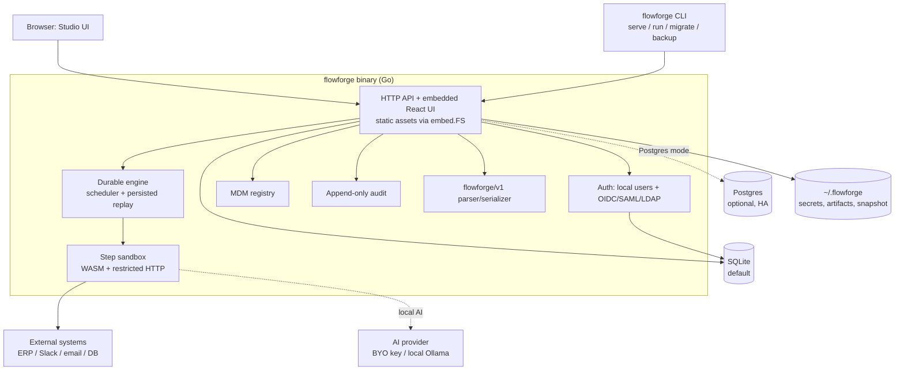
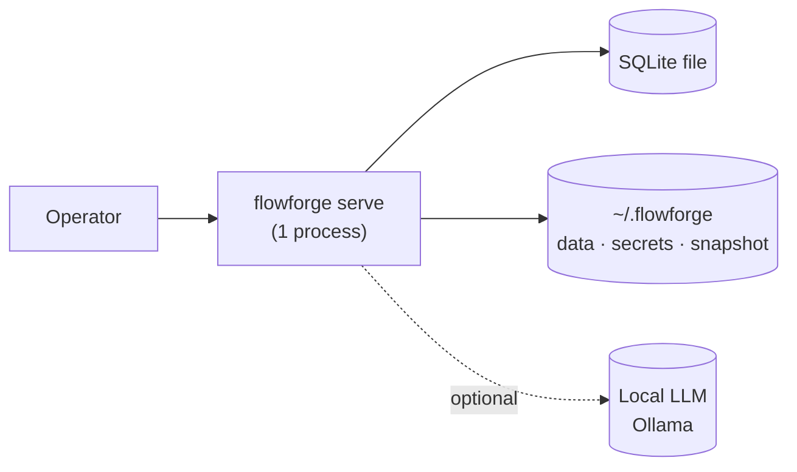
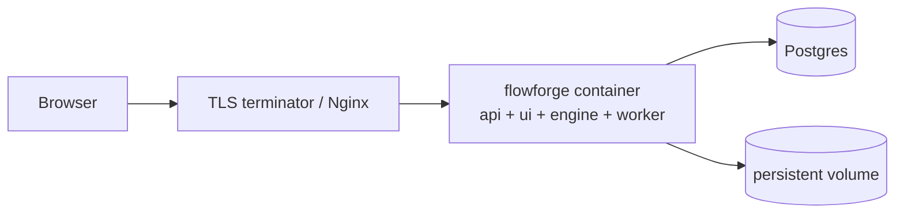
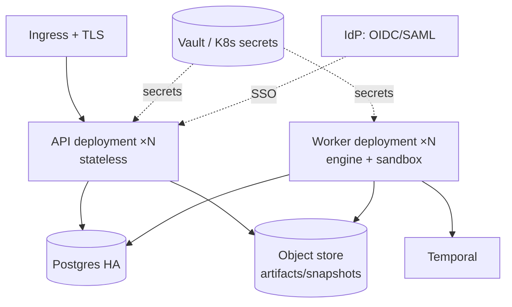
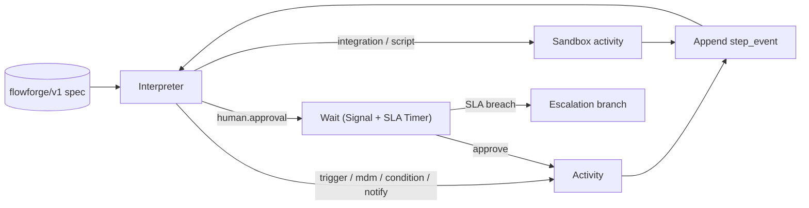
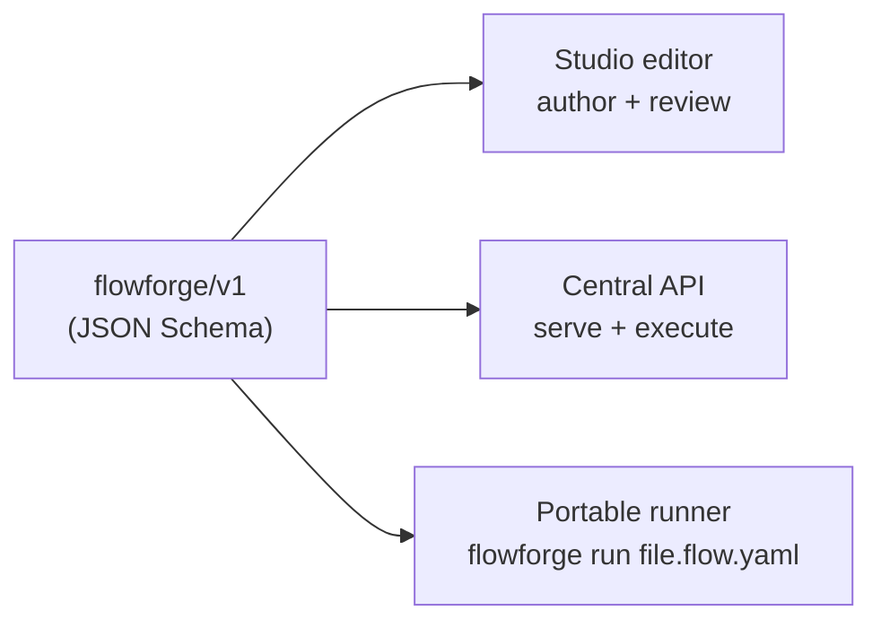
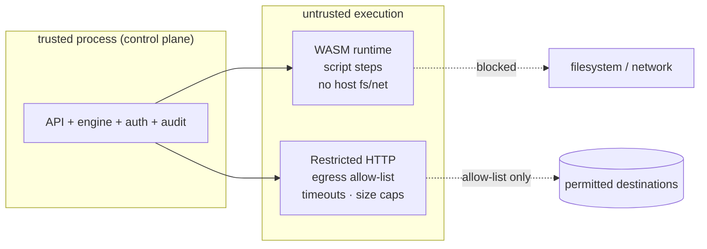

# FlowForge — Architecture (Downloadable Product)

| | |
|---|---|
| **Document** | System architecture for the self-hosted/distributable product |
| **Status** | Draft for review |
| **Version** | 1.0 |
| **Last updated** | 2026-08-01 |
| **Related** | [product-design.md](./product-design.md) · [build-plan.md](./build-plan.md) · [design-and-production-plan.md](./design-and-production-plan.md) |

---

## 1. Design goals

1. **One artifact, many topologies** — the same binary runs on a laptop, in Docker, or in HA Kubernetes.
2. **Two engines, one DSL** — a simple in-process durable engine for standalone; Temporal for enterprise HA. Both execute the identical `flowforge/v1` spec.
3. **Safe by default** — trusted control plane; untrusted step execution isolated.
4. **No external dependencies by default** — embedded DB, embedded UI, local-capable AI.

## 2. Container view (the single binary)

### Component responsibilities

| Component | Responsibility |
|---|---|
| **HTTP API** | REST surface (`/api/v1/*`); serves embedded UI; authz; the only trusted entrypoint. |
| **Auth** | Local users (bcrypt) + OIDC/SAML/LDAP; session/API tokens; RBAC. |
| **Durable engine** | Interprets a spec step-by-step; persists every transition; human-task wait/resume; retry-from-failed. |
| **Step sandbox** | Runs `script`/`ai`/`integration` steps in isolation; enforces egress allow-list + resource limits. |
| **MDM registry** | Golden records, stewardship, resolution (live or bundled snapshot for the runner). |
| **Audit** | Append-only, hash-chained, exportable. |
| **DSL** | Versioned parser/serializer + JSON Schema; the single contract. |

## 3. Deployment topologies

### 3a. Single binary (laptop / single-server / air-gap)

- One process, embedded UI, SQLite, in-process engine.
- Zero external dependencies. Ideal for air-gapped.

### 3b. Team (docker-compose)

- One container; Postgres optional but recommended for durability.

### 3c. Enterprise (Kubernetes, HA)

- Stateless API replicas; separate worker replicas for the engine + sandbox.
- Temporal provides cross-process durability/replay; object store for signed artifacts + MDM snapshots.
- Secrets via Vault / Kubernetes secrets; SSO via enterprise IdP.

## 4. Execution engine (two tiers, one contract)

- **Community/standalone:** in-process scheduler, persisted to SQLite, replay-on-restart. Equivalent semantics to today's prototype engine.
- **Enterprise/HA:** the **same interpreter** expressed as a Temporal workflow; activities = steps; signals = human approvals; timers = SLA/escalation. Completed activities are never re-run on replay.

The DSL and interpreter are the shared, tested contract; only the runtime host changes.

## 5. The DSL as the portable contract

- One spec consumed by **three** runtimes.
- Signed artifacts: each deployed version is serialized, hashed, signed; the runner verifies before executing.
- Spec is versioned (`flowforge/v1`, `v2`, …) with an RFC process; the runner supports N-1.

## 6. Security boundaries

- The control plane is trusted; everything that executes user-supplied logic is isolated.
- **Default-deny egress** unless an allow-list is configured.
- Resource limits (CPU/memory/time) on every sandboxed activity.

## 7. AI layer

- **Model-agnostic adapter:** OpenAI, Anthropic (via OpenAI-compatible gateways), Azure, OpenRouter, Groq, Together, **Ollama / LM Studio (local)**.
- Configured at runtime from the Admin console (already prototyped) or via env/config.
- **Deterministic fallback** when no model is configured or unreachable — the demo always works.
- PII redaction option before cloud calls; per-org model policy; AI governance log (prompt, model, confidence, cost).

## 8. Technology stack

| Concern | Standalone edition | Enterprise edition |
|---|---|---|
| Language/binary | **Go** (single static binary, `embed.FS` UI) | Go |
| API | REST `/api/v1` (Fastify-equivalent in Go: net/http + chi/echo) | + GraphQL (optional) |
| UI | React + Vite, embedded static assets | same |
| Database | **SQLite** (embedded) | **Postgres** (HA) |
| Execution | In-process durable engine | **Temporal** |
| Auth | Local users (+ OIDC) | OIDC / SAML / LDAP + RBAC |
| Secrets | env / encrypted local file | Vault / K8s secrets |
| Sandbox | **wazero** (WASM) + restricted HTTP | + sidecar containers |
| Realtime | SSE | SSE / WebSocket |
| AI | OpenAI-compatible adapter + local | same + governance |
| Packaging | Binary + Docker + Helm | Helm |

> The current prototype (`app/` Node UI + `server/` Node/TS + SQLite) is the **reference implementation** that defines the contract; the Go distributable targets the same DSL/types and is validated by a shared conformance suite.

## 9. Cross-cutting

- **Configuration precedence:** CLI flags > env > `flowforge.yaml` > defaults.
- **Observability:** structured logs → stdout/files; `/health`; Prometheus metrics; OpenTelemetry traces (API → engine → sandbox → connectors).
- **Versioning:** API (`/api/v1`), DSL (`flowforge/v1`), and product SemVer are independent and governed.
- **Tenancy:** `org_id` on every row; row-level security enforced at API (and optionally DB) level.

## 10. Data model (summary)

Mirrors the prototype and the [production data model](./design-and-production-plan.md#8-domain-model--data-schema): `organizations`, `users/roles`, `workflows` → `workflow_versions`, `instances` → `step_events` (event-sourced), `human_tasks`, `audit_log` (hash-chained), `mdm_entities/records`, `controls`, `artifacts` (signed), `ai_runs` (governance), `secrets_refs` (reference only).

---

*See [build-plan.md](./build-plan.md) for how to build this, phased.*
