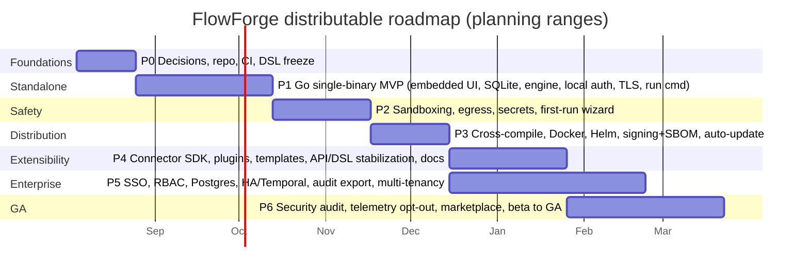

# FlowForge — Build Plan (Roadmap to Public Release)

| | |
|---|---|
| **Document** | Phased build plan for the downloadable product |
| **Status** | Draft for review |
| **Version** | 1.0 |
| **Last updated** | 2026-08-01 |
| **Scope** | From the current prototype to a public, downloadable, self-hostable tool |
| **Related** | [product-design.md](./product-design.md) · [architecture.md](./architecture.md) |

---

## 1. Starting point

- **`app/`** — React/Vite Studio UI (author → approve → run → monitor → dashboard), now backend-backed.
- **`server/`** — Node/TS control plane (Fastify + SQLite), durable in-process engine, LLM authoring, MDM, metrics.
- This is a **working reference implementation** that defines the `flowforge/v1` contract and the UX. The build plan hardens it into a downloadable product and ports the distributable to Go (single binary).

## 2. Strategy

- **Contract-first:** freeze `flowforge/v1` (JSON Schema + parser) and the REST surface early; everything targets it.
- **Two tracks in parallel after Phase 1:** (A) safety/distribution, (B) enterprise features.
- **Keep the reference (Node) demoable** while the Go distributable is built; a shared conformance suite proves parity.
- **Release a public beta early** (single binary, safe-by-default, local AI) — then harden to GA.

## 3. Phased roadmap

### Phase 0 — Foundations & decisions *(2–3 weeks)*
- License decision (Apache-2.0 open-core proposed), **trademark registration**, edition split finalized.
- Confirm **Go** distributable; repo restructure (monorepo: `dsl`, `server-go`, `ui`, `runner`, `connectors`, `docs`).
- **Freeze `flowforge/v1`**: JSON Schema + Go parser + TS parser, round-trip tests.
- CI (build, test, lint, SBOM), release pipeline skeleton.
- **Exit:** contract frozen; CI green; signed hello-world binary builds.

### Phase 1 — Single-binary MVP *(6–7 weeks)* — *“a real, downloadable FlowForge”*
- Go control plane: REST `/api/v1`, embedded React UI (`embed.FS`), SQLite.
- Port the **in-process durable engine** (persisted replay, human-task wait/resume, retry-from-failed) — validated against the Node reference via conformance tests.
- Built-in local auth (bcrypt), sessions/API tokens; **self-signed TLS** on first run.
- CLI: `serve`, `run <file.flow.yaml>` (portable runner with bundled MDM snapshot), `migrate`, `version`.
- AI adapter (OpenAI-compatible + local + deterministic fallback).
- MDM registry, audit, dashboard.
- **Exit:** one binary downloaded → `flowforge serve` → full describe→approve→run→track loop; `flowforge run file.flow.yaml` works offline.

### Phase 2 — Safety & first-run *(4–5 weeks)* — *release blocker*
- **Sandboxing:** WASM (`wazero`) for `script` steps; restricted HTTP client for connectors.
- **Egress allow-list** (default-deny option); per-step resource limits (CPU/mem/timeouts).
- **Secrets:** encrypted local file + env; never logged.
- **First-run setup wizard** (admin user, storage, IdP-or-skip, AI provider).
- Safe-mode toggle (disable script/arbitrary-HTTP).
- **Exit:** no user-supplied logic runs in the trusted process; safe-mode demonstrable.

### Phase 3 — Distribution *(3–4 weeks)*
- Cross-compile matrix (linux/darwin/win × amd64/arm64).
- Docker image + `docker-compose.yml`; **Helm chart**.
- Release artifacts: checksums, **cosign signatures**, **SBOM**.
- Opt-in auto-update with signature verification.
- **Exit:** one-line install on each platform; reproducible, signed release.

### Phase 4 — Extensibility & ecosystem *(5–6 weeks)*
- **Connector SDK** (typed contract, auth, dry-run mocks, contract tests).
- **Plugin loading** for custom step types (WASM/plugin protocol).
- **Templates gallery** (from the six demo workflows).
- Stabilize public API + DSL with SemVer and a deprecation policy; docs site + 5-minute quickstart.
- **Exit:** an external contributor can add and ship a connector end-to-end.

### Phase 5 — Enterprise edition *(parallel, ~10 weeks)*
- OIDC/SAML/LDAP SSO; fine-grained RBAC; teams.
- Postgres backend; **HA** (stateless API replicas + worker replicas).
- **Temporal** engine (same interpreter); object store for artifacts/snapshots.
- Multi-tenancy; audit export/retention; compliance packs.
- **Exit:** HA deployment with SSO and durable cross-process execution.

### Phase 6 — Beta → GA *(6–8 weeks)*
- **Anonymous opt-out telemetry** + first-run prompt.
- **External security audit** + pen test; `SECURITY.md`; responsible-disclosure process.
- Template/connector **marketplace** (community).
- Performance/load testing; runbooks; public beta → fixes → **GA**.
- **Exit (GA):** signed binary + Docker + Helm; safe-by-default; docs; security posture validated.

## 4. Team & effort (planning ranges)

Assumes ~5–6 people: 1 tech lead, 2–3 backend (Go), 1 frontend, part-time SRE + design.

| Phase | Duration | Lead need |
|---|---|---|
| 0 — Foundations | 2–3 wks | Tech lead |
| 1 — Single-binary MVP | 6–7 wks | Full team |
| 2 — Safety & first-run | 4–5 wks | Backend-heavy |
| 3 — Distribution | 3–4 wks | SRE + backend |
| 4 — Extensibility | 5–6 wks | Full team |
| 5 — Enterprise | ~10 wks (parallel) | Backend-heavy |
| 6 — Beta → GA | 6–8 wks | Full team |

**~4–5 months to a public single-binary beta** (end of Phase 3); **~7–9 months to GA** with enterprise edition.

## 5. Milestone definitions

- **Public Beta (after P3):** downloadable signed binary + Docker; safe-by-default; local AI; the full UX loop; 5-minute quickstart.
- **GA (after P6):** Beta + hardened sandboxing audited, enterprise edition (SSO/RBAC/HA), connector SDK + templates, telemetry, security audit passed.

## 6. Risks & mitigations

| Risk | Impact | Mitigation |
|---|---|---|
| Sandboxing gap → customer compromise | Critical liability | Default-deny egress, WASM isolation, safe-mode; **audit before GA** |
| Go rewrite drifts from Node reference | Behavioral bugs | Shared DSL + conformance test suite as the gate |
| DSL churn breaks runner/artifacts | Broken portability | Freeze in P0; SemVer + RFC; signed version-pinned artifacts; runner supports N-1 |
| Install friction kills adoption | Low uptake | Single binary, zero-config SQLite, 5-min quickstart |
| Enterprise features creep into core | Unclear free/paid line | Maintain the edition table; gate features behind the enterprise build flag |
| Trademark/license ambiguity | Fork/brand risk | Apache core + registered trademark; clear AUP |
| Heavy deps break air-gap promise | Loses key differentiator | No hard cloud/LLM dependency; bundle local model + snapshot |

## 7. Immediate next steps (first 2–3 weeks)

1. Approve: **Apache-2.0 open-core**, **Go distributable**, **SQLite-default/Postgres-optional**, **trademark**.
2. Restructure the repo; extract `flowforge/v1` JSON Schema + Go/TS parsers with round-trip tests.
3. Stand up the Go binary skeleton (`serve` + embedded UI + SQLite) mirroring the Node API.
4. Port the in-process durable engine to Go; build the **conformance suite** that both engines must pass.
5. Draft the **security/threat model** and the **edition feature table**.

---

*This plan operationalizes [product-design.md](./product-design.md) against [architecture.md](./architecture.md).*
