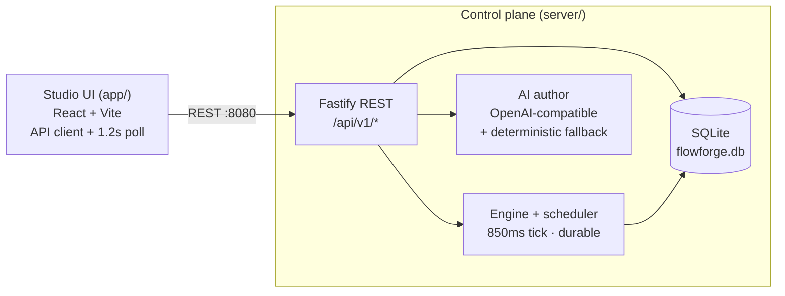

# FlowForge — Demo Runbook

How to run and demo the **working prototype**. This is a real, backend-backed app (Node/TS + SQLite) that showcases the key usability features end-to-end. SSO/RBAC are intentionally deferred — there is a single demo user.

> **Two processes:** `server/` (control-plane API on :8080) and `app/` (Studio UI on :3000). Run both.

---

## 1. Prerequisites

- **Node.js 20+** (built and tested on Node 22).
- **npm 10+**.
- (Optional) An **OpenAI-compatible API key** for genuine AI authoring. Without one, authoring uses a deterministic local generator so the demo always works.

## 2. First-time setup

```bash
# 1. Control plane
cd server
cp .env.example .env          # then edit .env (optional: set OPENAI_API_KEY)
npm install
npm run dev                   # http://localhost:8080

# 2. Studio UI (new terminal)
cd app
npm install
npm run dev                   # http://localhost:3000
```

Open **http://localhost:3000**. The UI loads demo workflows, executions, MDM, controls, and audit from the API.

### Enabling real AI authoring (optional)

You can configure the model **from the UI**: open **Admin → “AI authoring model”** and choose a provider. Options include OpenAI, OpenRouter (Anthropic/Google/Meta), Groq, Together AI, **Ollama (Local)**, **LM Studio (Local)**, or any custom OpenAI-compatible endpoint. Enter the API key, base URL, and model, click **Test connection**, then **Save**. Changes take effect immediately — no restart. Keys are stored on the server and sent only to the chosen endpoint.

Equivalently, seed it via `server/.env` (read once on first start; the UI setting takes precedence once saved):

```env
OPENAI_API_KEY=sk-...                         # required for real LLM drafts
OPENAI_BASE_URL=https://api.openai.com/v1     # any OpenAI-compatible endpoint
OPENAI_MODEL=gpt-4o-mini                      # gpt-4o, gpt-4.1, etc.
```

Any OpenAI-compatible endpoint works, including **Ollama** (`http://localhost:11434/v1`, model `llama3.1`) and **LM Studio** (`http://localhost:1234/v1`). If no key is set for a cloud provider or the endpoint is unreachable, the server automatically falls back to the deterministic generator.

> The UI shows which engine produced a draft: `flowforge-author (deterministic · no API key set)` vs. the configured model name (see the Studio header and `/api/v1/health`).

## 3. Where the data lives

- **`server/flowforge.db`** — SQLite file. Delete it to re-seed fresh demo data on next start. All execution state is durable here; executions resume after a server restart.

---

## 4. Demo script (5–7 minutes)

**Pillar 1 — Conversational authoring + trust layer**

1. Open the **Studio**. Paste (or click *Sample 1*):
   > "When a vendor invoice over $10K arrives, extract line items, validate against the vendor master, route to the cost-center manager for approval, escalate to Finance VP after 48 hours, then post to the ERP."
2. Click **Generate workflow**. Watch the AI phases, then the draft appears on the canvas with **per-step confidence** and **highlighted assumptions**.
3. Double-click a step (or click the pencil) to edit it; click **JSON** to view/edit the raw definition.
4. Point out the assumptions checklist at the bottom — *nothing is trusted until a human confirms*.

**Pillar 2 — Human approval as a trust primitive**

5. Click **Approve & deploy**. Note the toast: "Nothing executed until a human approved this AI draft." This approval is on the audit trail.

**Pillar 3 — API-first + step-level observability**

6. Click **Run now** → lands on **Executions**. Watch each step go pending → running → succeeded, with outputs and durations, **live**.
7. When the **Human Approval** step turns *waiting*, click **Approve as … (simulate)** → execution resumes.
8. Select the seeded **failed** execution (`run-9b1c`, ERP timeout). Click **Retry from failed step** → it resumes *only* the failed step and completes.

**Pillar 3b — Tracking dashboard**

8b. Open **Dashboard**. Show fleet KPIs (total runs, success rate, running/waiting/failed, avg duration), the **14-day execution trend** and **outcome mix** charts, and the **workflow tracker** table (per-workflow runs, success bar, avg duration, last run).
8c. Click a workflow to drill in: see its **recent executions** with inline **Approve / Retry / Cancel** actions, a **step-performance** chart (avg duration per step), and **Run with input** — set `total` below the threshold (e.g. 5000) to watch the condition auto-approve the manager step, or above it (24000) to route to a human approval.

**Pillar 4 — Portability**

9. Go to **Workflows** → **Download .flow.yaml**. Open it — this single `flowforge/v1` file is the portable artifact.

**Pillar 5 — Master data**

10. Open **Master Data**. Show vendors/customers/products/employees golden records; add a record (it enters as *pending stewardship*).

**Pillar 6 — Governance**

11. Open **Admin**: fleet stats, the human task queue, the live **audit trail** (AI draft, approval, runs, MDM), and the **step-controls** registry — add a custom control (e.g. `custom.send_sms`) and see it appear in the Studio palette.
12. In the same Admin view, show the **“AI authoring model”** card: switch providers (OpenAI / OpenRouter / Groq / Together / **Ollama (Local)** / **LM Studio (Local)** / Custom), paste a key, **Test connection**, and **Save** — authoring in Studio immediately uses the chosen model.

## 5. API quick reference (the UI is just a client)

```bash
# Health / config
curl http://localhost:8080/api/v1/health

# One-shot load of everything the UI needs
curl http://localhost:8080/api/v1/bootstrap

# Author a draft from a prompt
curl -X POST http://localhost:8080/api/v1/ai/draft \
  -H "Content-Type: application/json" \
  -d '{"prompt":"When an invoice over $10K arrives, validate the vendor, route to the manager, then post to ERP."}'

# Create + approve + run (run accepts optional entity + input used by conditions)
curl -X POST http://localhost:8080/api/v1/workflows -H "Content-Type: application/json" -d '{ "name":"Demo","description":"d","prompt":"p","steps":[...] }'
curl -X POST http://localhost:8080/api/v1/workflows/<id>/approve
curl -X POST http://localhost:8080/api/v1/workflows/<id>/executions -H "Content-Type: application/json" -d '{"entity":"INV-1234 · Acme","input":{"total":24000}}'

# Tracking dashboard: fleet KPIs, 14-day series, outcome mix, per-workflow stats
curl http://localhost:8080/api/v1/metrics

# All executions of one workflow (per-workflow tracking)
curl http://localhost:8080/api/v1/workflows/<id>/executions

# Watch it run, then resolve the human task / retry the failed one / cancel
curl http://localhost:8080/api/v1/executions/<id>/steps
curl -X POST http://localhost:8080/api/v1/executions/<id>/approve
curl -X POST http://localhost:8080/api/v1/executions/<id>/retry
curl -X POST http://localhost:8080/api/v1/executions/<id>/cancel
```

Full surface: `ai/draft`, `workflows` (CRUD + `/approve` + `/executions` [GET list + POST run with input]), `executions` (`/steps`, `/approve`, `/retry`, `/cancel`), `metrics`, `mdm`, `controls` (CRUD + `/toggle`), `settings/ai` (GET/PUT + `/test`), `audit`, `bootstrap`, `health`.

## 6. Prototype architecture



- **Durable by design:** each step transition is written to SQLite before the tick ends; restart the server mid-run and execution resumes where it stopped.
- **Single source of truth:** the UI calls the same REST endpoints an external integrator would.

## 7. Known limitations (prototype)

- No authentication / RBAC / multi-tenancy (single demo user).
- Engine is an in-process scheduler, not Temporal (no cross-process HA/replay at scale).
- Timestamps are display strings ("just now"), not real ISO times.
- Audit is append-only but not hash-chained/signed.
- Test Lab runs a client-side sandbox simulation (not the server engine in dry-run mode, yet).
- No portable Go runner or artifact signing yet.

See [`design-and-production-plan.md`](./design-and-production-plan.md) for the path from this prototype to production.
