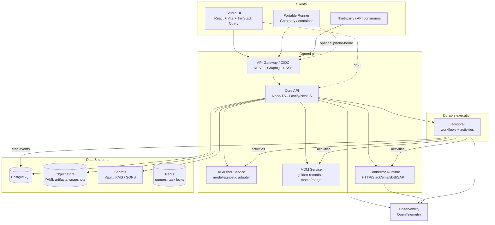
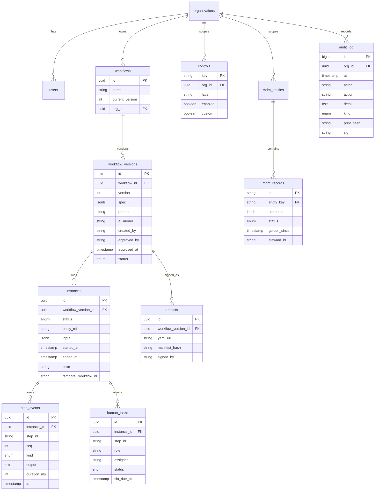
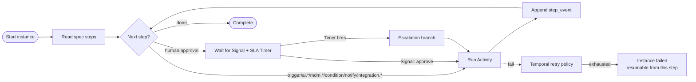
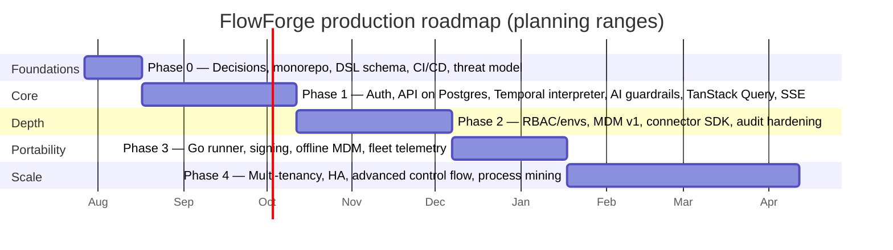

# FlowForge — Design & Production Plan

| | |
|---|---|
| **Document** | Design & Production Plan |
| **Status** | Draft for review |
| **Version** | 1.0 |
| **Last updated** | 2026-07-26 |
| **Audience** | Engineering, platform/SRE, product, security |
| **Scope** | Taking the FlowForge prototype to a production platform |

## Table of contents

1. [Executive summary](#1-executive-summary)
2. [Background & current state](#2-background--current-state)
3. [Goals & non-goals](#3-goals--non-goals)
4. [Guiding principles](#4-guiding-principles)
5. [Target architecture](#5-target-architecture)
6. [Technology decisions](#6-technology-decisions)
7. [Reuse vs. rebuild](#7-reuse-vs-rebuild)
8. [Domain model & data schema](#8-domain-model--data-schema)
9. [Execution engine design](#9-execution-engine-design)
10. [`flowforge/v1` DSL formalization](#10-flowforgev1-dsl-formalization)
11. [API contract](#11-api-contract)
12. [AI authoring service](#12-ai-authoring-service)
13. [Master data management (MDM)](#13-master-data-management-mdm)
14. [Connectors](#14-connectors)
15. [Auth, RBAC & multi-tenancy](#15-auth-rbac--multi-tenancy)
16. [Security & compliance](#16-security--compliance)
17. [Observability](#17-observability)
18. [Testing strategy](#18-testing-strategy)
19. [DevOps & release](#19-devops--release)
20. [Phased roadmap](#20-phased-roadmap)
21. [Team & effort](#21-team--effort)
22. [Risks & mitigations](#22-risks--mitigations)
23. [Open decisions](#23-open-decisions)
24. [Glossary](#24-glossary)

---

## 1. Executive summary

FlowForge is an enterprise workflow platform whose thesis is: *describe a business process in plain language → AI drafts it → a human reviews and approves it → it runs centrally via API or as a portable offline file.*

The repository now contains two layers:

- **`app/`** — the React/Vite/TypeScript Studio UI (the product surface).
- **`server/`** — a Node/TypeScript control-plane prototype (Fastify + SQLite) with a durable step-by-step execution engine, MDM, an append-only audit log, and an LLM authoring endpoint. This is a working, demo-grade backend; it deliberately defers SSO/RBAC, multi-tenancy, and HA.

The product UX, domain model, and `flowforge/v1` mental model are strong and are preserved. The production plan replaces the prototype internals with a real platform whose centerpiece is **Temporal** as the durable execution engine — the prototype's per-step, resumable, human-in-the-loop execution model maps directly onto Temporal workflows, activities, signals, and timers.

**Target outcomes**

- A durable, replayable, step-observable execution engine.
- Governed AI authoring with mandatory human approval and an immutable audit trail.
- A formalized, versioned, signed `flowforge/v1` spec consumed identically by the editor, the API, and a portable Go runner.
- Master-data-grounded workflows with golden records and stewardship.
- Real auth/RBAC, secrets management, multi-tenancy, and observability.

**Timeline (planning ranges):** ~5–6 months to a credible single-tenant, central-execution GA (end of Phase 2); ~7–8 months to the full "run anywhere" story including the portable runner.

---

## 2. Background & current state

### What exists today (the working prototype)

- **`app/`** — React 19 + Vite + Tailwind/shadcn + `@xyflow/react` UI. Sections: Home, Studio (NL → draft → review → approve), Workflows, Test Lab, Executions (Monitor), Admin (queue + audit + custom controls), MDM.
- **`server/`** — Fastify control plane:
  - SQLite persistence (`workflows`, `instances`, `audit`, `mdm`, `controls`); seeded with realistic demo data; survives restarts.
  - A scheduler-driven engine that advances instances one transition per tick, persists each transition, pauses on `human.approval`, and supports retry-from-failed-step and cancel.
  - An OpenAI-compatible LLM authoring endpoint with an automatic deterministic fallback when no key is set.
  - REST endpoints under `/api/v1/*`.
- The UI is **backend-backed**: the mock store was replaced by an API client + live polling, preserving the same method names the sections already used.

### What is still prototype-grade (must be hardened for production)

- Auth/RBAC, multi-tenancy, secrets management — absent (intentionally deferred).
- The execution engine is an in-process `setInterval`, not a durable orchestrator (Temporal in production).
- Time is stored as display strings ("just now") rather than real timestamps.
- Audit is append-only but not hash-chained/signed.
- The portable runner, artifact signing, and connector SDK do not yet exist.

---

## 3. Goals & non-goals

**Goals (production)**

1. Real "describe → approve → run → track" loop, durable across restarts.
2. Step-level observability with retry-from-failed-step and no full-flow re-runs.
3. Governed AI authoring (model-agnostic, including fully local).
4. Portable, signed `.flow.yaml` artifacts that run offline.
5. MDM-grounded, traceable executions.
6. API-first: the UI is just a client.
7. Enterprise readiness: SSO/RBAC, audit, secrets, multi-tenancy.

**Non-goals (initial GA)**

- Visual BPMN parity with IBM BPM/jBPM.
- A built-in IDE or full expression language.
- Marketplace/payment, process mining, AI self-improvement (later phases).
- Replacing the React UI with another framework.

---

## 4. Guiding principles

1. **Preserve the prototype's best assets** — the UX and domain model survive; we replace innards, not the product.
2. **The store is the API contract** — the backend already implements the method names the UI calls; production extends this contract.
3. **Buy durability, don't build it** — Temporal for the orchestrator. Hand-building replay/retry/SLA/signals is the top project risk.
4. **One spec, three consumers** — `flowforge/v1` is formalized once and used by the editor, API, and runner.
5. **Vertical slices** — each phase ships a complete loop with increasing depth.
6. **Design for tenancy from day one** — row-level `org_id` and authz in Phase 1, even when single-tenant.

---

## 5. Target architecture

**Logical layers**

- **Clients** — Studio UI, portable runner, external API consumers.
- **Control plane** — API gateway (OIDC, REST/GraphQL, SSE), core API, AI author service, MDM service, connector runtime.
- **Durable execution** — Temporal workers hosting the workflow interpreter and step activities.
- **Data & secrets** — PostgreSQL (source of truth), object store (signed artifacts + MDM snapshots), Vault/KMS (credentials), Redis (task locks, queues).
- **Cross-cutting** — OpenTelemetry traces/metrics/logs across all services.

---

## 6. Technology decisions

| Concern | Decision | Rationale |
|---|---|---|
| Durable orchestrator | **Temporal** | Replay, activity retry, timers (SLA), signals (human approval), versioning — directly matches the prototype's engine semantics. |
| Core API | **Node.js + TypeScript** (Fastify today; NestJS option later) | Share DSL + domain types with the UI as an npm package; the prototype already uses Fastify. |
| Portable runner | **Go** CLI + scratch container | Single static binary, tiny image, true air-gapped portability. |
| Database | **PostgreSQL** | Relational core; `jsonb` for spec & MDM attributes. (SQLite today for the prototype.) |
| Instance state | **Event-sourced `step_events`** | Reconstructs the Monitor timeline; enables replay and future process mining. |
| Realtime | **SSE** (WebSocket later) | Replaces the prototype's 1.2s poll with pushed step updates. |
| Auth | **OIDC** (Keycloak/Authelia self-host, or Okta/Auth0) | SSO + RBAC. |
| Secrets | **Vault / cloud KMS** + **SOPS** for at-rest config | Connectors need credentials; never stored in the DB. |
| Frontend data | **TanStack Query** + **Zustand** (UI-only state) | Server cache, invalidation, retries; retires the bespoke polling store. |
| AI | **Model-agnostic adapter** (OpenAI/Anthropic/Azure/Ollama) | The prototype already uses an OpenAI-compatible endpoint; honors "local-capable." |
| Repo | **Monorepo** (pnpm + Turborepo) | Shared `@flowforge/dsl`, `@flowforge/types`, generated clients. |
| Infra | **Kubernetes** (Temporal via Helm) or managed Temporal | HA, scale, reproducible envs via Terraform. |

Alternatives considered: **Cadence** (Temporal predecessor — prefer Temporal), **AWS Step Functions** (vendor lock-in, weaker human-task model), **hand-rolled + Outbox + Quartz** (rejected — reinvents Temporal poorly), **Restate/DBOS** (viable; Temporal chosen for maturity).

---

## 7. Reuse vs. rebuild

| Prototype asset | Disposition | Notes |
|---|---|---|
| `app/src/sections/*` (7 screens) | **Keep** | Already backend-backed via the API client. |
| `app/src/lib/types.ts` | **Promote** | To `@flowforge/types`; extend for tenancy/auth. |
| `app/src/lib/dsl.ts` + `server/src/yaml.ts` | **Promote & unify** | To `@flowforge/dsl`; add parser + JSON Schema for round-trip (currently duplicated TS/TS). |
| `app/src/components/FlowCanvas.tsx` | **Keep** | Already handles React Flow edge cases well. |
| `step.tsx`, `StepPanel.tsx`, `JsonTree.tsx` | **Keep** | — |
| `app/src/lib/store.tsx` (now API-backed) | **Replace** with TanStack Query | Keep method shape; add cache/invalidation. |
| `server/src/engine.ts` (in-process scheduler) | **Replace** | Temporal interpreter; same semantics. |
| `server/src/ai.ts` | **Keep & extend** | Add provider abstraction, guardrails, governance logging. |
| `react-router` (decorative) | **Activate** | Real routes + protected routes. |

---

## 8. Domain model & data schema

**Key modeling choices**

- **Spec immutability via `workflow_versions`.** A deployed version is immutable; in-flight instances bind to the version they started on.
- **Event-sourced execution.** `step_events` (ordered by `seq`) reconstruct the Monitor timeline and enable replay and process mining. (The prototype stores `stepRuns` JSON on the instance row; production normalizes to events.)
- **Append-only, hash-chained `audit_log`.** Tamper-evident and exportable.
- **AI governance via `ai_runs`.** Every draft generation records prompt, model, params, output, confidence, assumptions, latency, cost.
- **Secrets by reference only.** Values live in Vault/KMS, never in the DB.
- **Tenancy.** Every table carries `org_id`; row-level security enforced at API and (optionally) DB level.

---

## 9. Execution engine design

Each instance is **one Temporal workflow**. The workflow is a generic *interpreter* that reads the `flowforge/v1` spec and dispatches each step as an activity.

**Mapping prototype semantics → Temporal**

| Prototype concept | Temporal mechanism |
|---|---|
| Step runs sequentially; status pending→running→succeeded/failed | Sequential activities with retry policies |
| `human.approval` waits; approve resumes | `workflow.waitSignal('approve')` + Signal from API |
| SLA breach → escalation step | `workflow.timer(sla_hours)` branch |
| "Retry from failed step; never re-run completed" | Activity-level retry + Temporal replay (completed activities are not re-executed) |
| Step outputs/durations on the timeline | Each activity writes a `step_event` before returning |
| Durable across restarts | Temporal checkpoints per activity; inherent |

**Activity contract (per step type)**

- Input: `{ step, instanceContext, mdmSnapshot?, mode: 'live'|'dry-run' }`.
- Output: `{ status, output, durationMs }`.
- Activities are **idempotent** where side-effecting (integration writes carry idempotency keys).
- **Dry-run mode** (Test Lab): integration/notify activities are replaced with no-op mocks; the same interpreter runs.

**Workers**

- Central workers: live activities, live MDM, real connectors.
- Portable runner (Go): the *same interpreter semantics* with bundled MDM snapshot and sandboxed integration activities, optional phone-home; kept in sync by a shared conformance test suite.

---

## 10. `flowforge/v1` DSL formalization

- **JSON Schema** for `flowforge/v1`, validated on save (API), on edit (Studio JSON view), and on load (runner).
- **Reference parser + serializer** in `@flowforge/dsl` (TypeScript); a **Go port** for the runner, kept in sync by a shared conformance corpus.
- **Spec semver** (`flowforge/v1`, `v2`, …) with an RFC process; the runner supports N-1.
- **Artifact signing**: each deployed version is serialized to YAML, hashed, and signed; the runner verifies before executing.

---

## 11. API contract

REST first (the prototype already implements a subset); GraphQL layered later. All endpoints org-scoped and authenticated in production.

| Method & path | Purpose |
|---|---|
| `POST /api/v1/ai/draft` | Author a draft from a prompt (LLM or fallback) |
| `GET/POST /api/v1/workflows` | List / create |
| `GET/PATCH /api/v1/workflows/{id}` | Read / update |
| `POST /api/v1/workflows/{id}/approve` | Human approval (required before deploy) |
| `POST /api/v1/workflows/{id}/executions` | Start an execution (idempotency-key supported) |
| `GET /api/v1/executions` | List instances |
| `GET /api/v1/executions/{id}` / `/steps` | Instance summary / step-level state |
| `POST /api/v1/executions/{id}/approve` | Resolve a waiting human task |
| `POST /api/v1/executions/{id}/retry` | Resume from the failed step |
| `POST /api/v1/executions/{id}/cancel` | Cancel instance |
| `GET/POST /api/v1/mdm/{entity}` | Query golden records / add record |
| `GET/POST/PATCH/DELETE /api/v1/controls[...]` | Step-control registry |
| `GET /api/v1/audit` | Full audit trail (filterable, exportable) |

**Design rules:** generated typed client (OpenAPI), idempotency keys on execution calls, consistent error model (RFC 9457), SSE for realtime.

---

## 12. AI authoring service

- **Model-agnostic adapter**: OpenAI, Anthropic, Azure OpenAI, **Ollama (local)** — already prototyped as an OpenAI-compatible endpoint.
- **Structured output**: model returns the `GeneratedDraft` shape (steps, params, per-step confidence, assumptions) via JSON Schema-constrained decoding.
- **Trust enforcement**: drafts are never executable; a named human approval is required and audited.
- **Guardrails**: bounded prompts, schema validation, confidence calibration, PII redaction for cloud providers, cost/latency budgets, per-org model policies.
- **Resilience**: automatic deterministic fallback when the model is unavailable (already in the prototype).
- **Governance**: every generation recorded in `ai_runs`.

---

## 13. Master data management (MDM)

- **Entities**: vendors, customers, products, employees (extensible); defined fields and golden records.
- **Lifecycle**: new records enter as `pending stewardship`; a steward promotes to `golden`.
- **Resolution**: workflows reference entities by ID (`vendors/V-10293`), never free text. MDM activities resolve against the live master (central) or a bundled snapshot (runner).
- **Mismatch handling**: route to a steward instead of failing silently.
- **Phasing**: lookup/validate + CRUD first (prototype); match/merge v1 + one sync connector in Phase 2; full engine in Phase 4.

---

## 14. Connectors

- **Connector SDK**: typed activity interface with config/auth/input-output schemas, retry semantics, dry-run mocks.
- **Registry**: built-in connectors (HTTP, email, Slack, webhook, database) + org-scoped custom connectors (matches the prototype's custom `controls`).
- **OpenAPI import**: generate typed steps from any OpenAPI spec (Phase 2).
- **Sandboxing**: Test Lab and dry-run executions use mocks; real side effects only in live runs.
- **Egress control**: per-org outbound allow-lists.

---

## 15. Auth, RBAC & multi-tenancy

- **SSO via OIDC** (Keycloak/Authelia self-host, or Okta/Auth0). Session and API tokens.
- **RBAC roles**: `author`, `approver`, `operator`, `admin`, `steward`, `viewer`.
- **Approval as a trust primitive**: deploy requires an `approver`; human-task steps require role membership.
- **Multi-tenancy**: `org_id` on every row; row-level security; per-org controls, MDM, connectors, model policies, secrets. Designed in Phase 1, populated as multi-tenant in Phase 4.
- **Prototype note:** auth is intentionally omitted today (single demo user).

---

## 16. Security & compliance

- Secrets only in Vault/KMS/SOPS; DB stores references.
- Signed artifacts; tamper-evident, hash-chained audit log.
- Encryption in transit and at rest; PII redaction before cloud LLM calls; data-residency options.
- Connector egress allow-lists; sandboxed Test Lab.
- Compliance scope (define in Phase 0): SOC 2 / GDPR / data residency; pen test before GA.
- SDLC: SAST, dependency scanning, SBOM, secret scanning in CI; least-privilege service accounts.

---

## 17. Observability

- **OpenTelemetry** traces spanning API → Temporal → activities → connectors, correlated by `instance_id` / `trace_id`.
- **Metrics**: instance throughput, per-step duration/failure rates, human-task SLA adherence, AI latency/cost, connector error rates.
- **Structured logs** with consistent correlation IDs.
- **User-facing**: the Monitor timeline and Admin console are direct projections of `step_events` and metrics.
- **Alerting**: failed-step spikes, SLA breaches, AI budget exhaustion, connector outages.

---

## 18. Testing strategy

| Layer | Approach |
|---|---|
| `@flowforge/dsl` | Exhaustive round-trip + JSON Schema tests (the spec is sacred) |
| API | Contract tests; the generated client is tested against them |
| Engine | Temporal workflow **replay** tests + activity unit tests — correctness lives here |
| Connectors | Mocked HTTP servers; contract tests per connector |
| AI authoring | Golden-file tests for draft shape; schema-conformance on outputs |
| UI | Component tests (Vitest/Testing Library) + E2E (Playwright) over the full loop each phase |
| Load | Concurrent-instance simulation against Temporal before GA |
| Runner ↔ engine | Shared conformance test corpus ensures Go runner matches central semantics |

---

## 19. DevOps & release

- **Infra as Code**: Terraform; reproducible dev/staging/prod.
- **GitOps** deploys; preview environments per PR.
- **Migrations**: versioned, reversible DB migrations; Temporal workflow versioning for zero-downtime interpreter upgrades.
- **Environments & promotion**: dev → staging → prod; artifacts signed and promoted by digest.

---

## 20. Phased roadmap

### Phase 0 — Foundations & hard decisions *(2–3 weeks)*
Confirm Temporal/stack/monorepo/OIDC; stand up monorepo, CI/CD, Terraform skeleton; author `flowforge/v1` JSON Schema + `@flowforge/dsl` round-trip tests; threat model and compliance scope.
**Exit:** deployable hello-world API + DB + Temporal + CI green; schema accepted.

### Phase 1 — Core vertical slice *(6–8 weeks)*
Migrate SQLite→Postgres (keep schema shape); OIDC + RBAC skeleton; move the engine onto Temporal; AI guardrails + governance; replace the polling store with TanStack Query + SSE; OpenTelemetry.
**Exit (Definition of Done):** a real user logs in, types a prompt, gets a real LLM draft, edits on canvas, approves (audited), starts an execution, watches real per-step progress, approves a human task, and retries a failed step — durable across a server restart.

### Phase 2 — Trust depth, MDM, connectors *(6–8 weeks)*
Full RBAC + approval workflows; environments & versioning; MDM v1 (golden records, stewardship, basic match/merge, one sync connector); connector SDK + registry (Slack, webhook, DB) and OpenAPI → steps; Test Lab backed by the real engine in dry-run mode; audit hardening (hash-chained, signed, exportable).

### Phase 3 — Portability & standalone runner *(4–6 weeks)*
Go runner consuming signed `flowforge/v1` YAML with bundled MDM snapshot, mocked integrations, optional `--report-to`; artifact signing + verification; container image; runner fleet telemetry.

### Phase 4 — Scale, governance, advanced *(ongoing)*
Multi-tenancy, HA/scale, performance/cost; parallel branches, loops, sub-workflows, compensation; process mining on `step_events`; AI copilot learning from edits.

---

## 21. Team & effort

Assumes a ~5–6 person team: 1 tech lead, 2–3 backend, 2 frontend, part-time SRE and design.

| Phase | Duration | Core need |
|---|---|---|
| 0 — Foundations | 2–3 wks | Tech lead + SRE |
| 1 — Core | 6–8 wks | Full team (crunch) |
| 2 — Trust/MDM/Connectors | 6–8 wks | Backend-heavy + 1 frontend |
| 3 — Portable runner | 4–6 wks | 1 Go engineer + backend |
| 4 — Scale/advanced | ongoing | Full team |

~5–6 months to a credible single-tenant central-execution GA; ~7–8 months to the full "run anywhere" story.

---

## 22. Risks & mitigations

| Risk | Impact | Mitigation |
|---|---|---|
| Hand-building durability instead of Temporal | Project failure | Mandate Temporal in Phase 0; no custom orchestrator |
| AI output drift / unbounded prompts | Bad drafts, trust erosion | Strict output schema + validation; bounded prompts; confidence/assumptions always surfaced; human gate |
| Connector sprawl | Maintenance sink | Connector SDK + contract tests; community contributions isolated |
| Spec churn breaks runners/artifacts | Broken portability | Semver + RFC; signed, version-pinned artifacts; runner supports N-1 |
| Frontend rewrites instead of refactors | Wasted UI work | Keep sections; the store contract is stable |
| MDM match/merge complexity | Quagmire | Lookup/validate first; defer real match-merge to Phase 2+; degrade to "route to steward" |
| Multi-tenancy retrofit pain | Expensive migration | `org_id` + authz from Phase 1 |
| Temporal operational burden | Outages/SRE cost | Managed Temporal Cloud, or well-instrumented self-host + runbooks |

---

## 23. Open decisions

1. Self-host Temporal vs. Temporal Cloud — cost/ops trade-off.
2. API framework: keep Fastify vs. move to NestJS.
3. OIDC provider: Keycloak/Authelia (self-host) vs. Okta/Auth0 (managed).
4. Default AI provider for Phase 1 (the prototype already supports any OpenAI-compatible endpoint).
5. Single shared interpreter vs. strict Go reimplementation for the runner.
6. GraphQL timing (Phase 2 vs. Phase 4).

---

## 24. Glossary

- **Control plane** — the central API, orchestrator, audit, vault, MDM, admin services.
- **DSL / `flowforge/v1`** — the versioned, human-readable workflow spec; the single artifact.
- **Instance** — one execution of a workflow version.
- **Step event** — an immutable record of one step's state transition; the timeline unit.
- **Golden record** — a steward-approved canonical MDM entity.
- **Human task** — an execution paused for a person's decision (approval).
- **Portable runner** — the offline Go executor of a signed `.flow.yaml`.
